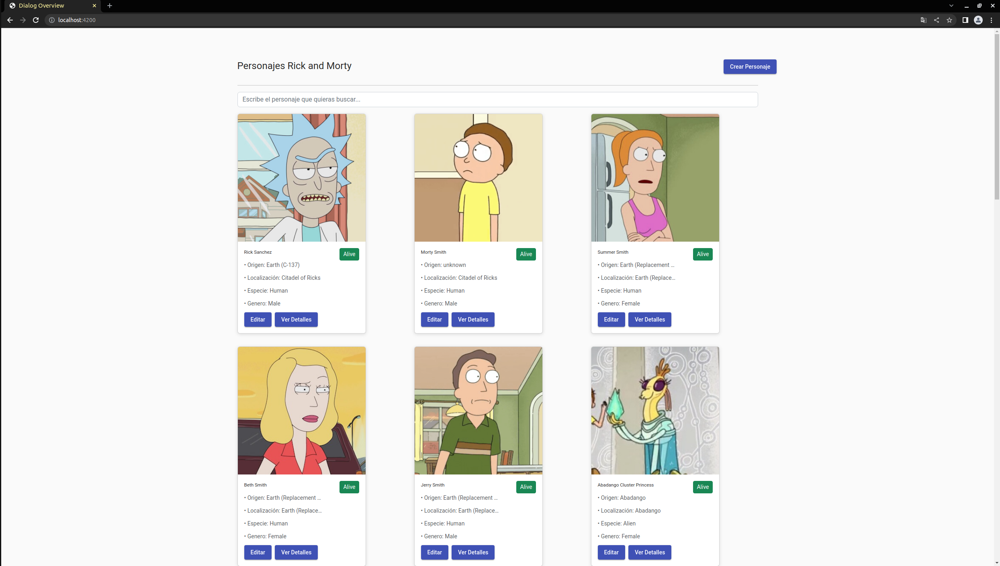

Proyecto para Angular Framework de Mercadona
=============================================


El proyecto se ha generado con la version [Angular CLI](https://github.com/angular/angular-cli) version **14.0.4**.

La web consiste en un buscador de elementos de estilo tarjeta con los personajes de la serie de TV Rick and Morty. El proyecto se ha apoyado en la API pública https://rickandmortyapi.com/api/character

El proyecto contiene una serie de funciones que te permiten buscar por el nombre de los personajes a través de un input de tipo buscador, ver los detalles de las tarjetas de los personajes, editarlos y crear nuevos. La parte de editar y crear funciona solo a nivel de web una vez refrescas se pierden los datos, ya que la api, no ofrece funciones **POST, PUT, DELETE**.



Arbol de estructura
--------------------

Este arbol respresenta los directorios del repositorio:

```
  .
  ├── media
  |    ├── screenshots
  └── src
      ├── app
      │   ├── components
      |   |  ├── card
      |   |  ├── dialog-character-create
      |   |  ├── dialog-character-edit
      |   |  └── dialog-character-details
      │   ├── interfaces
      │   ├── services
      │   └── shared
      └── environments
```

Arranque en local
------------------

Para arrancar la app en local, si es la primera vez que inicias o arrancas el proyecto usar la instrucción **`npm run start`** para bajarse todas las dependencias y arrancará el proyecto en modo desarrollo. Después en el navegador usar la url `http://localhost:4200/`. En la web la aplicación se refrescará automáticamente si tu modificar cualquier archivo o haces cualquier cambio en el repositorio.

Autor
-----

[Alberto Checa Muelas](https://es.linkedin.com/in/alberto-checa-muelas-12429b154)